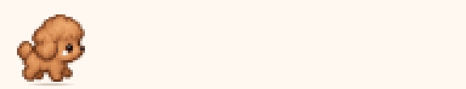
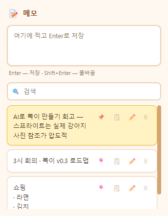
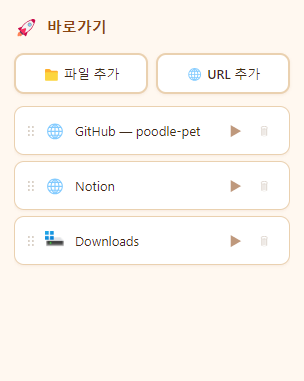
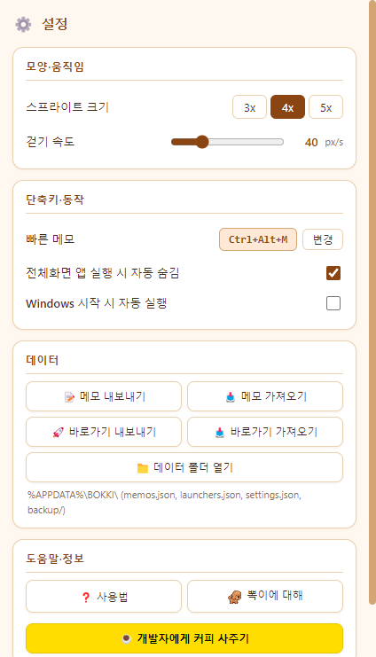
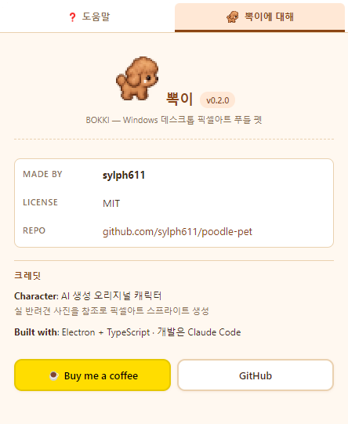

# 뽁이 (BOKKI) 🐩

Windows 바탕화면을 돌아다니는 갈색 픽셀아트 푸들 데스크톱 펫.
메모와 바로가기 기능이 함께 딸려 있습니다.

<p align="center">
  
</p>

<p align="center">
  <a href="https://github.com/sylph611/poodle-pet/releases"></a>
  
  
  <a href="https://buymeacoffee.com/sylph611"></a>
</p>

- 코드/repo 이름: `poodle-pet`
- 배포 프로그램명: **뽁이 (BOKKI)**
- 최신 릴리즈: [Releases](https://github.com/sylph611/poodle-pet/releases)
- 재밌게 쓰셨다면 ☕ [Buy me a coffee](https://buymeacoffee.com/sylph611)

## 스크린샷

<table>
  <tr>
    <td align="center"><b>메모</b><br></td>
    <td align="center"><b>바로가기</b><br></td>
  </tr>
  <tr>
    <td align="center"><b>설정</b><br></td>
    <td align="center"><b>뽁이에 대해</b><br></td>
  </tr>
</table>

## 실행 (개발)

```powershell
npm install
npm run gen:sprite     # 임시 스프라이트 생성 (첫 실행 시, 이미 sprite.png 있으면 스킵 가능)
npm run dev
```

## 설치파일 만들기

```powershell
npm run pack
# dist/BOKKI Setup 0.1.0.exe   (NSIS 인스톨러)
# dist/BOKKI-0.1.0-win.zip     (포터블 zip)
```

**SmartScreen 경고**: 코드 서명이 되어있지 않아 처음 실행 시 "Windows에서 PC를 보호했습니다" 경고가 나옵니다. **추가 정보 → 실행**을 눌러 진행하세요.

## 사용법

- **트레이 아이콘 우클릭 → 종료** (창 X 버튼은 memo/launcher만 숨김)
- **푸들 클릭** → 말풍선 (📝 메모 / 🚀 바로가기 / 💤 재우기)
- **푸들 드래그** → 어디로든 옮기기 (다중 모니터 OK). 놓으면 중력으로 바닥 착지
- **파일/폴더 드래그해서 푸들에게 드롭** → 바로가기로 자동 등록
- **`Ctrl+Alt+M`** → 빠른 메모 창 열기

## 개발

- `npm test` — 단위 테스트 (Vitest, 26개)
- `npm run test:e2e` — 스모크 테스트 (Playwright Electron, 3개)
- `npm run build` — 타입 체크 + 번들 빌드
- `npm run pack` — 설치파일 생성

## 스프라이트 교체

`characters/poodle/sprite.png`와 `manifest.json`을 교체하면 됩니다. 프레임은 32×32, 행 순서는 idle/walk/sit/sleep/drag/happy. AI로 뽑은 hi-res 스프라이트를 넣으려면:

1. 원본을 `characters/poodle/sprite-source-hires.png`로 저장
2. `node scripts/extract-frames.mjs` — 각 강아지 자동 검출·중앙정렬·192×192로 재구성

## 데이터 위치

`%APPDATA%\BOKKI\`
- `memos.json` / `launchers.json` / `settings.json`
- `backup/YYYY-MM-DD/` (최근 7일)

## 문서

- 설계서: `docs/superpowers/specs/2026-09-29-poodle-pet-design.md`
- 구현 계획: `docs/superpowers/plans/2026-09-29-poodle-pet.md`
- 개발 저널 (블로그 소스): `docs/blog/dev-journal.md`
