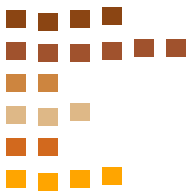

# Poodle Pet 개발 저널

> 티스토리 "SI 개발자의 AI 에이전트 실전 노트" 연재용 원본 자료.
> **진행 중** — 새 이슈·수정·시도가 나올 때마다 아래 "업데이트 로그"에 append.

## 업데이트 로그

| 일자 | 커밋 | 요약 |
|---|---|---|
| 2026-09-29 | `1e85cde` | 설계서(spec) 작성·커밋 |
| 2026-09-29 | `1e85cde..05211b5` | SDD로 14 태스크 완료 (17 커밋) + 최종 리뷰 fix |
| 2026-09-30 | `b69cdfd` | 셧다운 중 destroyed 창 접근 크래시 방지 (isDestroyed guards) |
| 2026-09-30 | `b0d5faf` | `file://` fetch 차단 우회 (sprite:get이 콘텐츠 직접 반환) |
| 2026-09-30 | `8064d28` | 실 강아지 사진 기반 AI 스프라이트 + 프레임 자동 추출 + 중력 물리 |
| 2026-09-30 | `9e108c7` | 블로그용 개발 저널 초안 |
| 2026-09-30 | `21012c7` | 말풍선 UX (토글·외부 클릭 닫기·드래그 따라오기) + 메모/런처/말풍선 카라멜 톤 리디자인 |

---

## 프로젝트 한 줄

Windows 바탕화면을 돌아다니는 **갈색 픽셀아트 푸들 데스크톱 펫**. Electron + TypeScript. 개발은 **Claude Code(Opus 4.7)** 로만.

## 왜 만드는가

1. **개인 도구**: 메모, 자주 쓰는 파일/폴더/URL 런처
2. **블로그 연재 소재**: "실제 AI 에이전트로 데스크톱 앱을 몇 시간에 만들 수 있는가"를 스스로 검증하고 기록
3. **재미**

## 기술 스택

- Electron 32 + TypeScript 5 + electron-vite
- Vanilla HTML/CSS/TS (React 안 씀)
- Vitest (unit) + Playwright Electron (e2e)
- electron-builder (NSIS)
- pngjs (스프라이트 스크립트)

## 결과물 스냅샷 (2026-09-30 기준)

- v1 기능 완성: 돌아다니기, 메모 CRUD·검색·고정, 파일/폴더/URL 런처, 전역 단축키
- 26/26 unit + 3/3 e2e 통과
- 실 강아지 사진 기반 갈색 푸들 스프라이트 (21 프레임)
- 브랜치 `impl/v1` — main 머지 대기

---

# Chapter 1. 설계 → 계획 → 실행 (Skill Chain)

## 워크플로우 개요

Superpowers 플러그인의 스킬 3개를 체이닝했다:

```
brainstorming  →  writing-plans  →  subagent-driven-development
    (스펙)         (14 태스크 계획)      (실행 + 리뷰 루프)
```

각 스킬은 다음 스킬로 넘겨주는 산출물(spec.md, plan.md)이 있어서 세션이 끊겨도 이어갈 수 있음.

## 산출물

- `docs/superpowers/specs/2026-09-29-poodle-pet-design.md` (설계서, 260줄)
- `docs/superpowers/plans/2026-09-29-poodle-pet.md` (구현 계획, 2748줄, 14 태스크)

## Brainstorming 단계

이전 세션에서 이미 4개 섹션 승인 완료 상태로 이 세션 시작. 사용자가 넘긴 승인 내용:
- 설계 1/4: 전체 구조 (창 옵션, Main/Renderer 구성, IPC, 캐릭터 교체 구조)
- 설계 2/4: 행동 (7개 상태, idle 확률, 30초→sleep, walk 규칙)
- 설계 3/4: 메모·런처 (Enter 저장, 드롭 등록, atomic write)
- 설계 4/4: 오류 처리, 테스트, 폴더 구조

**핵심 배운점**: brainstorming 스킬은 "설계서(spec)를 반드시 쓰고 사용자 승인 후 다음 단계"로 진행 — 심지어 "이건 너무 간단해서 스펙 안 써도 될 것 같은데"라는 유혹이 있어도 무조건 짧게라도 스펙을 쓴다. 이유: 스펙 없이 바로 코드 짜면 나중에 뒤엎을 확률이 높음.

## Writing Plans 단계

`writing-plans` 스킬은 14 태스크로 스펙을 쪼갬. 각 태스크의 조건:

1. **자기완결적**: 태스크 하나가 독립적으로 커밋 가능
2. **테스트 가능**: 검증 방법이 명시됨 (Vitest 유닛 / Playwright / 시각 확인)
3. **인터페이스 명시**: 이 태스크가 만드는 함수·타입·IPC 채널을 다음 태스크가 참조할 수 있도록
4. **바이트사이즈 스텝**: 각 태스크 안에서 2~5분짜리 스텝 8~10개

이렇게 짜면 Claude가 헤매지 않고 태스크 하나에 15~40분 안에 끝냄.

**Self-review로 발견한 2건**:
- Task 4의 `focusable: false` — 클릭·드래그가 안 먹힐 수 있음 → 제거
- Task 7의 mousemove 안 `action("dragStart")` 중복 호출 → `dragMove`만 호출

## SDD 단계

Fresh subagent를 태스크마다 파견, 리뷰 subagent가 검증, 실패시 fix loop.

- 워크스페이스: `.superpowers/sdd/<plan-basename>/` (git ignored)
- 레저: `progress.md`에 태스크별 완료 시점·커밋 SHA 기록 → **컨텍스트 압축돼도 복구 가능**
- 각 태스크 브리프는 `task-N-brief.md`로 파일화 → 컨트롤러 컨텍스트에 원문이 안 남음

## 삽질 / 배운점

- **Fresh subagent 패턴이 진짜 유효함**: 이전 태스크의 오해나 컨텍스트 폴루션 없이 시작. 리뷰도 독립적 관점으로.
- **파일 기반 아티팩트**: 브리프·리포트·diff 모두 파일로 넘김 → 컨트롤러가 계속 재읽지 않아도 됨.
- **레저는 정말 중요**: 세션이 길어지면 압축이 일어남. 레저 없이는 "내가 어디까지 했지?" 상황.
- **모델 선택**: transcription-heavy 태스크는 haiku, integration은 sonnet. 리뷰는 sonnet 이상. 컨트롤러가 자동 상속하면 비싸짐 — 항상 명시.

## 블로그 소재 후보

- **글감 1**: "Superpowers 스킬로 설계→구현 파이프라인 만들기" (3스킬 체이닝 워크플로우)
- **글감 2**: "왜 태스크마다 fresh subagent가 더 빠른가" (context pollution 이야기)
- **글감 3**: "구현 계획을 세울 때 태스크를 어떻게 쪼개야 하는가" (right-sizing)

---

# Chapter 2. SDD 실행 (14 태스크)

## 태스크 요약

| # | 태스크 | 모델 | 소요 | 이슈 |
|---|---|---|---|---|
| 1 | 부트스트랩 (electron-vite+vitest) | haiku | ~2분 | Minor: 빈 스텁에 log 있음 |
| 2 | Store (atomic write+backup) | haiku | ~1분 | Fix 1회: timestamp 포맷·store 인스턴스 export |
| 3 | Sprite manifest + 생성기 | haiku | ~1분 30초 | 없음 |
| 4 | 투명 펫 창 + 스프라이트 애니 | haiku | ~1분 40초 | Minor 3건 (import, race 등) |
| 5 | PetController 상태 머신 (TDD) | sonnet | ~1분 40초 | Minor: `wakeIfSleeping` 미구현 |
| 6 | walk 이동 + screen-utils | sonnet | ~1분 50초 | Minor: facing 매 tick 전송 |
| 7 | 클릭·드래그·말풍선 | sonnet | ~2분 15초 | Minor: dragMove workArea vs display |
| 8 | 트레이·전체화면·단일 인스턴스 | haiku | ~1분 | **Fix 1회: BrowserWindow import 누락, interval leak** |
| 9 | 메모 창 (CRUD·검색·고정) | sonnet | ~2분 15초 | 없음 |
| 10 | 전역 단축키 Ctrl+Alt+M | haiku | ~1분 40초 | 없음 |
| 11 | 런처 (드롭·아이콘·순서) | sonnet | ~4분 20초 | Minor 4건 (reorder stale, getFileIcon 등) |
| 12 | 화면 밖 복귀 | haiku | ~1분 50초 | 없음 |
| 13 | Playwright e2e | sonnet | **~49분** | **덤: 3개 프로덕션 버그 발견·수정** |
| 14 | electron-builder NSIS | haiku | ~3분 | winCodeSign 로컬 실패 |

## Fix Loop 사례

Task 2 리뷰 결과:
```
Important — Broken-file timestamp format wrong (store.ts:58)
Important — Named store instances missing
```

한 라운드 fix로 둘 다 해결. re-review 통과. 총 2분 추가.

Task 8:
```
Critical — Missing BrowserWindow import (tsc fails)
Important — Fullscreen interval not cleared on quit
```

한 라운드 fix. 부수적으로 `package-lock.json` 7324줄이 실수로 커밋됨 — 실은 표준 관행이라 수용.

## Task 13이 왜 49분?

Playwright e2e 작성 중 subagent가 **3개 프로덕션 버그를 발견·근본 fix**:

1. **Preload path**: `"type":"module"` → 빌드 산출이 `.mjs`인데 코드는 `../preload/index.js` 참조. Fix: `rollupOptions.output.format: "cjs" + entryFileNames: "[name].js"`
2. **`app.quit()` 60초 hang**: memo/launcher 창이 `close: e.preventDefault(); hide()`. Fix: `before-quit`에서 `BrowserWindow.getAllWindows().forEach(w => w.destroy())`
3. **Single-instance e2e 충돌**: 재시작 테스트가 lock 잡혀 두 번째 인스턴스가 즉시 종료. Fix: `E2E_TEST` env로 lock bypass

**교훈**: e2e 테스트는 유닛 테스트가 못 잡는 통합·수명주기 버그를 잡는다. e2e를 안 썼으면 **패키징 후 유저가 실행했을 때 아무것도 안 뜨는** 상황이 됐을 것.

## 최종 whole-branch 리뷰 결과

Sonnet reviewer가 2건 must-fix 발견:

- **`launchers:reorder` stale-id 시 데이터 손상** (`map.get(id)!` non-null assertion → `{ order: i }`만 저장)
- **`getFileIcon` unguarded rejection** (보호된 시스템 파일 접근 시 IPC reject → 런처 UI 파괴)

한 wave fix로 둘 다 해결 (`83bfabe`). 이후 실행 크래시(chapter 3)가 별도로 나옴.

## 블로그 소재 후보

- **글감 4**: "e2e 테스트가 유닛 테스트 100개보다 나은 이유" (Task 13 3개 버그 사례)
- **글감 5**: "AI 리뷰어에게 무엇을 시키면 안 되는가" (pre-judging 금지 등 SDD의 원칙)

---

# Chapter 3. 프로덕션 버그 사냥 (실행 후 발견)

SDD 완료 후 유저(내가) 직접 실행해보면서 발견한 크래시·이슈들. 모두 근본 원인 fix.

## 3.1 셧다운 중 destroyed 창 접근 크래시

**증상**: Playwright e2e나 앱 종료 순간에 이런 다이얼로그가 뜸.
```
TypeError: Object has been destroyed
    at App.<anonymous> (file:///.../out/main/index.js:349:22)
    at App.emit (node:events:518:28)
    at import_electron.app.emit (.../playwright-core/.../electron.js:10)
```

**원인**: `app.emit("second-instance")` 등이 셧다운 중에 호출되면 이미 destroy된 `currentPetWindow.show()`에 접근 → 크래시. 프로덕션에서도 유저가 앱 끄는 순간 다른 인스턴스가 실행되면 같은 크래시.

**Fix** (`b69cdfd`): `petWindowAlive()` 헬퍼로 3중 체크(`isShuttingDown + win.isDestroyed + webContents.isDestroyed`) 후 11 곳의 hot path에 guard 추가.

```ts
let isShuttingDown = false;
function petWindowAlive(): BrowserWindow | null {
  if (isShuttingDown) return null;
  const w = currentPetWindow;
  if (!w || w.isDestroyed() || w.webContents.isDestroyed()) return null;
  return w;
}
// ... 모든 setTimeout / setInterval / event handler 안에서 guard
```

**교훈**: Electron 앱은 셧다운 순서가 미묘하다. `before-quit` → 창 destroy → will-quit → app exit 사이에 아직 이벤트가 발화할 수 있음. 창을 만지는 모든 콜백은 `isDestroyed` 체크가 필수.

## 3.2 스프라이트가 안 뜨는 문제 — `file://` fetch 차단

**증상**: 창은 뜨는데 완전 투명. DevTools 열어보니:
```
Not allowed to load local resource: file:///D:/vibecoding/poodle-pet/characters/poodle/manifest.json
Uncaught (in promise) TypeError: Failed to fetch at main
```

**원인**: dev 서버가 `http://localhost:5173`에서 renderer 로드. 여기서 `file://`를 `fetch()`하면 Chromium이 mixed content로 차단. 프로덕션에서도 위험.

**Fix** (`b0d5faf`): sprite:get IPC가 URL 대신 **콘텐츠 직접** 반환.
```ts
ipcMain.handle("sprite:get", () => {
  const manifest = JSON.parse(readFileSync(join(characterDir, "manifest.json"), "utf8"));
  const bytes = readFileSync(join(characterDir, "sprite.png"));
  return {
    manifest,
    imageDataUrl: `data:image/png;base64,${bytes.toString("base64")}`,
    scale
  };
});
```

Renderer도 fetch 없이 dataURL 직접 사용:
```ts
const { manifest, imageDataUrl, scale } = await window.pet.getSprite();
const img = await new Promise<HTMLImageElement>((resolve, reject) => {
  const i = new Image();
  i.onload = () => resolve(i);
  i.onerror = reject;
  i.src = imageDataUrl;  // set src AFTER onload (레이스 방지)
});
```

**교훈**: Electron IPC는 URL 참조 대신 콘텐츠(dataURL, Buffer, parsed JSON)를 직접 넘기는 게 안전. 특히 dev/prod origin이 다를 수 있어서.

## 3.3 좀비 프로세스 230개

**증상**: 유저 왈 "뭐가 엄청 중복실행되어있는것 같은데?"

```
PS> (Get-Process electron | Where-Object {$_.Path -like '*poodle-pet*'}).Count
230
```

30분 동안 npm run dev 반복 실행 + 크래시 다이얼로그 뜬 채로 방치 = 230개 좀비. Electron 앱은 인스턴스당 5~7 프로세스라 실질 30~40번 반복.

**Fix**: `Get-Process electron | Where-Object {...} | Stop-Process -Force`

**교훈**:
- 앱 종료는 **항상 트레이 우클릭 → 종료**. X 버튼은 memo/launcher 창 hide만 함 (의도된 동작).
- `npm run dev` 종료 시 Ctrl+C 반드시.
- 크래시 다이얼로그 안 닫으면 프로세스 살아있음.

## 블로그 소재 후보

- **글감 6**: "Electron 셧다운 크래시 사냥 - isDestroyed guard 11곳" (Chapter 3.1)
- **글감 7**: "Electron dev/prod의 미묘한 차이 - file:// fetch 트랩" (Chapter 3.2)

---

# Chapter 4. 캐릭터 아트 여정

## 4.1 Placeholder (색 사각형)

첫 스프라이트는 Node 스크립트로 생성한 6행 × 각 색상 사각형. 애니 동작 검증용.



유저 첫 반응: **"야임마.. 그냥 사각형인데..?"**

의도된 상태였음 — spec에 placeholder는 별도 캐릭터 아트로 교체할 예정으로 명시. 하지만 유저 실망은 개발 동력에 영향.

## 4.2 AI 프롬프트 진화

**v1 (스프라이트 시트 통짜)**: 요건을 최대한 명시. 결과: 크기 안 맞고 semi-transparent edges 많음. 하지만 캐릭터 자체는 귀엽게 나옴.

핵심 프롬프트 요건 (블로그용으로 재활용 가능):
```
- Output: exactly 192×192 pixels (6×6 grid of 32×32 cells)
- Transparent background (RGBA)
- TRUE pixel art: hard 1-pixel edges, NO anti-aliasing, NO gradients
- Same character identity across all 21 frames
- All poses face RIGHT
- Row 0: idle 4 frames (breathing bob 1px)
- Row 1: walk 6 frames (leg cycle, body bob)
- Row 2: sit 2 frames
- Row 3: sleep 3 frames (z, z z, zzz)
- Row 4: drag 2 frames (kicking, wide eyes)
- Row 5: happy 4 frames (tail wag, tongue, heart on frames 1&3)
```

**v2 (실 강아지 사진 기반)**: 유저 반려견 사진을 레퍼런스로 첨부, "이 강아지의 특징(색, 털, 귀 모양)을 살려서 chibi pixel art로" 요청. 결과: **훨씬 개성 있고 귀여운** 캐릭터.

이 방식이 압도적으로 나음. 이유:
- "generic cute poodle"로 뽑으면 AI가 훈련 데이터의 흔한 스타일로 뽑음
- 실 사진이 있으면 AI가 색·비율·특징을 참조 → 개성 있는 캐릭터

## 4.3 크기 문제 — 1374×1145를 192×192로

AI(ChatGPT/DALL-E 등)는 32×32 픽셀 정확성이 약함. 결과가 1374×1145로 나옴 → **한 프레임당 220여 픽셀** → 앱은 좌상단 32×32만 잘라 씀 → 강아지 일부만 보임.

**Fix**: `scripts/resize-sprite.mjs` — 알파-가중 다운샘플로 192×192로 리사이즈. 알파 채널 보존.

```js
// 각 dest 픽셀 = 해당 src 블록 픽셀들의 알파-가중 평균 색
sumR += src.data[si] * a;
sumG += src.data[si + 1] * a;
sumB += src.data[si + 2] * a;
sumA += a;
// ...
dst.data[di] = Math.round(sumR / sumA);
dst.data[di + 3] = Math.round(sumA / count);
```

## 4.4 프레임 정렬 문제 — "뒤로 흐르는" idle, "위 그림 잘려서 나오는" walk

리사이즈 후 실행:
- **idle이 뒤로 흐르는 것처럼 보임**: 4개 프레임이 셀 안에서 미묘하게 X 위치가 다름 → 반복 재생 시 좌우로 흘러가는 착시
- **walk 시 위 행 내용 잘려서 나옴**: AI가 그린 강아지가 정확한 6×6 그리드에 안 맞아 인접 셀 내용이 섞임
- **walk가 앞으로 툭툭 튐**: 프레임 간 X 위치 불균등

**단순 fps 조정으로는 해결 안 됨** — 프레임 위치 자체 문제. 근본 fix는 **각 강아지를 원본에서 자동 검출해 셀 중앙에 재배치**.

`scripts/extract-frames.mjs` (약 100줄):

```js
// 1. 원본을 y row별 실루엣 픽셀 개수로 밴드 6개 자동 검출
const yBands = findBands(rowSums, 3, 10);

// 2. 각 밴드 안에서 x 방향으로 강아지 그루핑
const xGroups = findBands(colSums, 2, 6);

// 3. 각 강아지의 bbox 계산 → 최대 28×28로 스케일 → 32×32 셀 중앙(수평) + 바닥(수직) 정렬
const scale = Math.min(1, 28 / maxDim);
const offX = Math.floor((S - outW) / 2);
const offY = S - outH - 1;

// 4. 알파-가중 다운샘플로 배치
```

실행 결과 (로그):
```
detected 6 horizontal bands: [33-212] [244-418] [448-626] [644-810] [836-999] [1015-1214]
[idle] band y[33-212] → 4 figures (expected 4)
[walk] band y[244-418] → 6 figures (expected 6)
[sit] → 2, [sleep] → 3, [drag] → 2, [happy] → 4
```

세 이슈 모두 근본 해결.

## 4.5 fps 튜닝 (보완)

프레임 정렬 후에도 AI 프레임은 완벽한 애니 사이클이 아니라 낮은 fps가 더 자연스러움:

```json
// manifest.json — 원래 (Task 3에서 정한 값) → 최종
"idle":  { "fps": 4 → 3 },
"walk":  { "fps": 8 → 5 },
"happy": { "fps": 8 → 6 },
"drag":  { "fps": 6 → 5 }
```

## 블로그 소재 후보

- **글감 8**: "AI로 게임 스프라이트 시트 뽑는 실전 프롬프트" (v1·v2 프롬프트 진화)
- **글감 9**: "AI가 뽑은 스프라이트를 게임에 붙이는 후처리 파이프라인" (resize + extract 스크립트)
- **글감 10**: "실 반려견 사진에서 픽셀아트로 - 프롬프트 한 방으로 개성 만드는 법"

---

# Chapter 5. 애니메이션 튜닝

## 5.1 잡았다 놓으면 뚝 떨어짐 — 중력 물리 추가

**증상**: 유저가 펫을 잡아서 화면 위로 옮긴 뒤 놓으면 **700ms 뒤 순간이동으로 바닥에 붙음**.

원인: PetController의 fall 상태는 700ms 후 자동 idle 전환 → main의 idle 핸들러가 `setBounds(y: groundY)` 실행 → 순간이동.

**Fix** (`8064d28`): fall 상태에 중력 물리 추가.

```ts
const GRAVITY = 1800; // px/s² (카툰 느낌)
let fallVy = 0;

// tick 루프 안
if (controller.state === "fall" && prevState !== "fall") fallVy = 0;

if (controller.state === "fall") {
  fallVy += GRAVITY * (dt / 1000);
  const newY = b.y + fallVy * (dt / 1000);
  if (newY >= groundYNow) {
    win.setBounds({ x: b.x, y: groundYNow, width: petSize, height: petSize });
    fallVy = 0;
    controller.forceState("idle");  // 착지 즉시 idle 전환
  } else {
    win.setBounds({ x: b.x, y: Math.round(newY), width: petSize, height: petSize });
  }
}
```

PetController의 `FALL_MS`는 700 → 3000ms(안전 상한)로 상향. 물리가 항상 먼저 착지 판단.

**교훈**: 순수 상태 머신은 시간 기반이지만, 애니 상태(fall처럼 물리 필요한)는 물리 판단에 위임. State machine은 상태 진입/종료를 관리, 상태 지속시간은 물리가 결정.

## 블로그 소재 후보

- **글감 11**: "Electron에서 카툰 물리 만들기 - setInterval + 중력 상수 하나면 끝"

---

# Chapter 6. 말풍선 UX 튜닝 + UI 리디자인

## 6.1 말풍선의 세 가지 조건

유저 요청: "클릭했을때 아이콘창이 뜨는데 다른 빈곳 또는 다시 재클릭하면 없어져야 하고, 드래그할땐 따라오면 좋겠어."

세 조건이 서로 살짝 충돌한다:
- **재클릭 토글**: 두 번째 pet 클릭 시 hide
- **외부 클릭 자동 닫힘**: 화면 어디를 클릭해도 hide
- **드래그 시 따라오기**: 드래그 중에는 pet 옆에 유지

외부 클릭 감지의 정석은 `bubble.show()`로 focus를 잡은 뒤 `blur` 이벤트로 hide. 하지만 pet 클릭도 focus를 뺏으니 blur가 걸림 — 그리고 드래그 시작 시 mousedown이 focus를 뺏어 bubble이 사라짐.

## 6.2 해결 패턴

**세 가지 트릭의 조합**:

1. **`bubble.show()` + `blur` 자동 hide** (외부 클릭 처리)
2. **`ignoreBubbleOpenUntil` 잠금 창** (재클릭 토글 레이스 방지)
   - blur → hide 직후 `now + 200ms` 잠금 설정
   - pet 재클릭이 blur → openBubble 순으로 오는데, openBubble이 잠금 창 안이면 무시
3. **100ms 유예 hide** (드래그 시 따라오기)
   - blur가 오면 즉시 hide하지 않고 100ms 뒤 예약
   - 그 사이에 `pet:action("dragStart")` 도착하면 예약된 hide 취소

```ts
let ignoreBubbleOpenUntil = 0;
let isDragging = false;
let blurHideTimer: NodeJS.Timeout | null = null;

ipcMain.on("bubble:open", (_, _anchor) => {
  if (Date.now() < ignoreBubbleOpenUntil) return;
  if (bubble.isVisible()) { bubble.hide(); return; }  // 토글
  positionBubbleAbovePet();
  bubble.show();  // focus 잡음
});

bubble.on("blur", () => {
  if (isDragging) return;
  if (blurHideTimer) clearTimeout(blurHideTimer);
  blurHideTimer = setTimeout(() => {
    blurHideTimer = null;
    bubble.hide();
    ignoreBubbleOpenUntil = Date.now() + 200;
  }, 100);  // 유예
});

ipcMain.on("pet:action", (_, kind) => {
  if (kind === "dragStart") {
    isDragging = true;
    if (blurHideTimer) { clearTimeout(blurHideTimer); blurHideTimer = null; }
  }
  // ...
});

ipcMain.on("pet:dragMove", (_, delta) => {
  // ... pet 이동
  if (bubble.isVisible()) positionBubbleAbovePet();  // 따라오기
});
```

**교훈**: Focus 기반 UX(popover, dropdown)에서 "click outside to close" + "click again to toggle"는 흔한 레이스. 짧은 무시 창(ignore window)이 정답. 200ms면 충분.

## 6.3 UI 리디자인 - 카라멜 톤 통일

기본 HTML 스타일이 "구리다"는 유저 피드백. 캐릭터(갈색 푸들) 컬러와 톤을 맞춘 팔레트로 통일.

**CSS 변수 팔레트** (memo·launcher·bubble 공통):
```css
:root {
  --bg: #FFF8F0;          /* cream */
  --surface: #FFFFFF;      /* card 배경 */
  --primary: #8B4513;      /* chocolate */
  --accent: #D4A574;       /* caramel */
  --accent-soft: #FFE8D6;  /* soft peach hover */
  --text: #3E2A1A;         /* dark brown */
  --text-muted: #8B6F52;
  --border: #EAD1B0;
  --pinned-bg: #FFF3C4;
  --pinned-border: #E8B923;
  --shadow-sm: 0 1px 3px rgba(139, 69, 19, 0.08);
  --shadow-md: 0 2px 8px rgba(139, 69, 19, 0.12);
}
```

**공통 디자인 규칙**:
- 카드형 리스트 아이템 (radius 10px, shadow-sm, hover 시 lift + shadow-md)
- 버튼 hover: `--accent-soft` 배경 + `--primary` 텍스트
- 스크롤바도 카라멜 색으로 (webkit-scrollbar)
- Pretendard/system-ui 폰트 스택
- 빈 상태 안내 문구 ("아직 메모가 없어요" / "푸들에게 파일을 끌어놓거나")
- 마이크로 인터랙션: `transition: all 0.15s`

**말풍선에는 꼬리 추가**: `::after`로 회전 사각형 → 창 크기 60→72px로 상향.

## 블로그 소재 후보

- **글감 12**: "Electron popover UX 3종세트 - focus + blur + ignore-window로 완벽 토글" (Ch 6.1~6.2)
- **글감 13**: "5분 만에 앱을 귀엽게 만들기 - CSS 변수 팔레트 하나면 끝" (Ch 6.3)

---

# 부록 A. 재사용 가능한 프롬프트

## A.1 실 반려견 사진 → 픽셀아트 스프라이트

```
[첨부: 반려견 사진]

Look at the [색] [견종] in the attached photograph. Create an ORIGINAL cute chibi pixel-art sprite sheet inspired by THIS specific dog's appearance.

INSPIRATION FROM THE PHOTO — capture these traits from the reference:
- Match the dog's specific fur color
- Match the fur texture
- Match the ear shape and position
- Match any distinctive features
- Overall vibe: extremely cute chibi interpretation of THIS dog

CHARACTER STYLE (chibi pixel art):
- Chibi proportions: big head (~40% of frame height), small round body, 4 short stubby legs, puffy pom-pom tail
- One expressive dark eye visible (facing right)
- Small dark nose
- Small white cheek/eye highlight

CRITICAL TECHNICAL REQUIREMENTS:
- Output: single PNG, EXACTLY 192×192 pixels total
- Layout: 6 rows × 6 columns, each cell EXACTLY 32×32 pixels
- Character centered in each cell, ~24×24 within
- TRUE pixel art: hard 1-pixel edges, NO anti-aliasing, NO gradients
- Transparent background (RGBA)
- All poses face RIGHT

SHEET LAYOUT:
Row 0 — IDLE, 4 frames: standing, subtle breathing bob
Row 1 — WALK, 6 frames: trot cycle, alternating legs
Row 2 — SIT, 2 frames: sitting with front legs down
Row 3 — SLEEP, 3 frames: lying curled, z/zz/zzz above
Row 4 — DRAG, 2 frames: mid-air, wide eyes, kicking legs
Row 5 — HAPPY, 4 frames: tail wag, pink tongue, tiny heart on frames 1 & 3

OUTPUT: transparent PNG, no borders/labels/watermarks.

If you cannot output exactly 192×192, tell me the actual dimensions — do NOT silently upscale.
```

## A.2 Spec 브레인스토밍 (개인 Windows 앱)

TBD (요건 나올 때 정리)

## A.3 실행 후 스프라이트 원본 처리

원본 파일 넘기고 이렇게 요청:
```
Read manifest.json for expected animation layout. Extract each puppy from the source hi-res image via connected-component detection (skip low-alpha edge pixels), auto-crop, and place centered in the corresponding 32×32 cell. Write scripts/extract-frames.mjs and run it.
```

---

# 부록 B. 유용한 스크립트

- `scripts/gen-placeholder-sprite.mjs` — 색 사각형 placeholder 생성 (Task 3)
- `scripts/resize-sprite.mjs` — hi-res AI 출력 → 192×192 알파-가중 다운샘플
- `scripts/center-frames.mjs` — 셀 내부 재중앙 정렬 (프레임이 이미 잘 잘려있을 때)
- `scripts/extract-frames.mjs` — **hi-res 원본에서 강아지 자동 검출 + 재배치** (가장 강력)

---

# 부록 C. 커밋 히스토리 요약

```
1e85cde  docs: v1 spec + plan (SDD 시작점)
40c1dd7  Task 1: 부트스트랩
9668d34..0d58637  Task 2: Store + fix round
a2c59af  Task 3: 스프라이트 매니페스트
8562545  Task 4: 투명 창 + 애니
e12f934  Task 5: PetController (TDD)
8d95e34  Task 6: walk 이동
217ed21  Task 7: 클릭·드래그·말풍선
f11b2f5..7cc4135  Task 8: 트레이 + fix
9c9b799  Task 9: 메모
2678e08  Task 10: 단축키
a1642a5  Task 11: 런처
be7d773  Task 12: 화면 밖 복귀
ab12e5a  Task 13: e2e (덤: 3개 프로덕션 버그 fix)
05211b5  Task 14: NSIS 패키징
83bfabe  최종 리뷰 fix (reorder + getFileIcon)
b69cdfd  isDestroyed guards (셧다운 크래시)
b0d5faf  sprite IPC 콘텐츠 반환 (file:// 우회)
8064d28  실 강아지 스프라이트 + 중력 물리
```

---

# 다음 세션에서 이어갈 것

- [ ] 아직 안 다뤄진 이슈: 단축키 충돌 (Ctrl+Alt+M) — 재부팅 후 재현 여부
- [ ] 페트 상태별 화면 확인 (happy, sleep, drag, sit, fall)
- [ ] impl/v1 → main 머지 여부
- [ ] 캐릭터 아트 추가 튜닝 (빨간 테두리 제거 등)
- [ ] 블로그 첫 편 실제 작성 시작 → 이 저널을 소스로

## 블로그 소재 총정리 (지금까지)

1. Superpowers 스킬로 설계→구현 파이프라인 (Ch 1)
2. Fresh subagent가 왜 더 빠른가 (Ch 1)
3. 태스크 right-sizing (Ch 1)
4. e2e가 유닛보다 나은 순간 (Ch 2)
5. AI 리뷰어에게 시키면 안 되는 것 (Ch 2)
6. Electron 셧다운 크래시 사냥 (Ch 3.1)
7. file:// fetch 트랩 (Ch 3.2)
8. AI 스프라이트 시트 프롬프트 실전 (Ch 4.2)
9. AI 출력 후처리 파이프라인 (Ch 4.3~4.4)
10. 실 반려견 사진 → 픽셀아트 개성 (Ch 4)
11. Electron 카툰 물리 (Ch 5.1)
12. Popover 3종세트 (토글·외부 클릭·드래그 유지) (Ch 6.1~6.2)
13. CSS 변수 팔레트로 앱 리디자인 (Ch 6.3)
