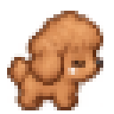

# Claude Code로 데스크톱 앱 하나 만들었다 — 설계부터 배포까지

> **뽁이(BOKKI) 개발기 시리즈 · 1편**
> 브레인스토밍 → 스펙 → 14 태스크 → SDD → 인스톨러 · GitHub Release · 자동 업데이트까지. 하루 만에.

## TL;DR

- **결과물**: Windows 바탕화면 갈색 픽셀아트 푸들 펫 [뽁이(BOKKI)](https://github.com/sylph611/poodle-pet). 메모·바로가기 런처·전역 단축키 포함. `.exe` 인스톨러 + 자동 업데이트.
- **도구**: Claude Code (Opus 4.7) + Superpowers 스킬 체인
- **프로세스**: brainstorming → writing-plans → **subagent-driven-development** (SDD)
- **핵심 배운점**: "간단한 앱이라도 스펙부터"·**Task마다 fresh subagent**·**e2e 테스트가 유닛 100개보다 나은 순간**

<p align="center">
  
</p>

---

## 1. 왜 데스크톱 펫을 만들었나

3가지 이유가 있었다.

- **개인 도구**: 매일 쓰는 메모 앱은 이미 있지만 "빠른 메모" 접근성이 늘 아쉬웠음. 바탕화면에 상주하는 친구가 있으면 좋겠다는 생각.
- **블로그 연재 소재**: "AI 에이전트로 앱을 실제로 얼마나 빨리 만들 수 있나"를 스스로 검증해서 기록으로 남기고 싶었음.
- **재밌어 보임**: 픽셀아트 강아지가 화면 아래를 돌아다니는 게 그냥 귀엽지 않나.

목표는 하루 만에 **설계 → 코드 → 인스톨러 → GitHub Release**까지. 결론부터 말하면 달성했고 실제로 자동 업데이트까지 붙였다.

---

## 2. 재료: Superpowers 스킬 체인

Claude Code에 [Superpowers](https://github.com/obra/superpowers) 플러그인을 얹으면 여러 스킬(작업 절차 템플릿)이 딸려온다. 이번엔 3개를 순서대로 체인했다.

```
brainstorming  →  writing-plans  →  subagent-driven-development
    (스펙)         (14 태스크 계획)      (실행 + 리뷰 루프)
```

각 스킬의 역할:

- **brainstorming**: 아이디어를 스펙(spec)으로 정제. 의도적으로 질문 → 대답 → 승인 사이클을 돈다. "명확하지 않은 것은 코드로 옮기지 마라."
- **writing-plans**: 스펙을 실행 가능한 태스크 목록으로 쪼갠다. 각 태스크는 자기완결 + 독립 커밋 가능.
- **subagent-driven-development (SDD)**: 계획을 실행. **태스크마다 fresh subagent를 파견**하고 별도 subagent가 리뷰. 컨텍스트 오염 없이 반복.

각 스킬은 다음 스킬로 넘겨줄 **파일 산출물**(spec.md, plan.md)을 남기는 게 핵심이다. 세션이 중간에 끊겨도 이어갈 수 있고, 나중에 팀에 공유할 수도 있다.

---

## 3. "간단한 앱이라도 스펙부터"

brainstorming 스킬에는 이런 문구가 있다:

> **Anti-Pattern: "This Is Too Simple To Need A Design"**
>
> Every project goes through this process... "Simple" projects are where unexamined assumptions cause the most wasted work.

**"이 정도는 스펙 없이 바로 코딩해도 되지 않나?"** 라는 유혹이 매번 있는데 통계적으로 그렇게 시작한 작업은 나중에 뒤엎을 확률이 훨씬 높다.

이번엔 그 유혹을 참고 스펙을 먼저 썼다. 4개 섹션으로 나눠 승인을 받았다:

1. **전체 구조**: 창 옵션, Main/Renderer 구성, IPC, 캐릭터 교체 구조
2. **행동**: 7개 상태(idle/walk/sit/sleep/drag/fall/happy), 확률 규칙, 30초→sleep
3. **메모·런처**: Enter 저장, 드래그앤드롭 등록, atomic write
4. **오류 처리·테스트·구조**: 폴더 배치, 백업 전략, 실패 케이스 대응

작성한 스펙: [2026-09-29-poodle-pet-design.md](https://github.com/sylph611/poodle-pet/blob/main/docs/superpowers/specs/2026-09-29-poodle-pet-design.md)

**셀프 리뷰에서 잡은 것**: 백업 경로가 "파일별 백업"인지 "통합 백업"인지 애매해서 인라인으로 명확화. 사소해 보이지만 이런 걸 코드 짜다 발견하면 이미 두 번 짠 뒤다.

---

## 4. 14 태스크로 쪼개기

스펙을 writing-plans에 넘기면 실행 가능한 태스크 목록이 나온다. 계획을 세울 때 지킨 원칙:

1. **자기완결**: 태스크 하나가 독립 커밋 가능 (다른 태스크 없이 리뷰·롤백 가능)
2. **인터페이스 명시**: 이 태스크가 만드는 함수·타입·IPC 채널을 명시. 다음 태스크의 브리프에 참조로 넣음
3. **바이트사이즈 스텝**: 각 태스크 안에서 2~5분짜리 스텝 8~10개

결과: [14 태스크 · 총 2748줄 계획](https://github.com/sylph611/poodle-pet/blob/main/docs/superpowers/plans/2026-09-29-poodle-pet.md)

```
Task 1  : 프로젝트 부트스트랩 (electron-vite + vitest)
Task 2  : Store (atomic write + 백업 로테이션)
Task 3  : Sprite manifest + placeholder 생성기
Task 4  : 투명 펫 창 + 스프라이트 애니메이션 렌더러
Task 5  : PetController 상태 머신 (TDD)
Task 6  : 화면 경계·walk 이동
Task 7  : 클릭/드래그/말풍선 메뉴
Task 8  : 트레이 + 전체화면 자동 숨김 + 단일 인스턴스
Task 9  : 메모 창 (CRUD·검색·고정)
Task 10 : 전역 단축키 Ctrl+Alt+M
Task 11 : 런처 창 + 드롭 등록 + 아이콘
Task 12 : 화면 밖 복귀 훅
Task 13 : Playwright Electron 스모크
Task 14 : electron-builder NSIS + README
```

이렇게 짜 두면 Claude가 태스크 하나에 15~40분 안에 끝낸다. **컨텍스트가 안 헷갈리는 크기**가 핵심이다.

---

## 5. SDD 실행: 왜 태스크마다 fresh subagent를 파견하나

여기가 이 시리즈의 핵심 인사이트다.

기존 방식: **한 세션에서 계속 작업**. Claude 창 하나에 모든 대화·코드·리뷰가 쌓임.
문제: 태스크 8쯤 가면 컨텍스트가 오염됨. 이전 태스크의 잘못된 가정, 폐기된 접근, 사소한 오해가 계속 살아있다.

SDD 방식: **태스크마다 새 subagent 파견**.

```
Controller (컨트롤러 세션, 오래 유지)
    ├─ Task 1 → subagent A (fresh, 태스크만 앎, 완료 후 종료)
    ├─ Task 2 → subagent B (fresh, Task 1의 커밋만 참조)
    ├─ Task 3 → subagent C (fresh)
    └─ ...
```

각 subagent에는 **딱 그 태스크의 브리프 파일**만 준다. 컨트롤러 세션의 대화는 넘기지 않는다. Subagent는 자기 태스크를 커밋한 뒤 종료. 다음 태스크의 subagent는 이전 커밋을 git에서 읽는다.

리뷰도 마찬가지: **별도 리뷰 subagent**가 diff만 보고 spec 준수·품질 검증. 구현자는 "self-graded"를 못 한다.

### 모델 선택

Superpowers는 태스크마다 모델을 선택하라고 가이드한다:

- **Transcription 성 태스크** (계획에 코드가 다 있음): 가장 저렴한 모델 (haiku)
- **Integration·판단**: 중간 (sonnet)
- **아키텍처·리뷰**: 가장 능력 있는 모델 (opus)

이번 프로젝트 14 태스크의 실제 모델 분배:

| 유형 | 태스크 | 모델 |
|---|---|---|
| Transcription (부트스트랩·설정·단순 CRUD) | Task 1, 2, 3, 4, 8, 10, 12, 14 | haiku |
| Integration·상태머신·UI | Task 5, 6, 7, 9, 11, 13 | sonnet |

리뷰는 대체로 sonnet. 태스크 하나당 1-4분에 끝난다 (haiku 태스크는 1-2분, sonnet 태스크는 2-4분).

### Fix Loop

리뷰가 결함을 찾으면 **fix loop** 발동. 최대 5라운드까지 같은 subagent (or 승격된 모델)로 반복. 예:

- Task 2 리뷰: "Important — broken-file 타임스탬프 포맷 불일치 + memosStore 인스턴스 미노출"
- Fix subagent 파견 → 두 개 다 fix → re-review 통과. 총 2분.

계획을 잘 쪼갰다면 fix loop는 거의 안 돈다. 이번 14 태스크 중 fix loop가 돈 건 **Task 2, Task 8 두 번뿐**.

---

## 6. 실전 하이라이트: e2e가 유닛 100개보다 나은 순간

가장 짜릿했던 순간은 **Task 13 (Playwright Electron 스모크 테스트)** 이었다.

이 태스크의 목표는 단순했다: 앱 실행되는지 + 메모가 재시작에도 유지되는지 + 런처 등록되는지, 3개 시나리오 자동 검증.

Subagent가 e2e를 쓰면서 **3개의 진짜 프로덕션 버그를 발견하고 근본 fix했다**:

### 버그 1: preload 파일이 `.mjs`로 나와서 packaged 앱이 완전 파괴

- `package.json`에 `"type": "module"` → electron-vite가 preload를 `.mjs`로 빌드
- 근데 창들의 `webPreferences.preload`는 `../preload/index.js`를 참조
- 파일 없음 → preload 실패 → renderer 완전 파괴 (사용자는 그냥 "안 뜸")

Fix: `electron.vite.config.ts`에 rollup 옵션으로 CJS + `.js` 확장자 강제.

### 버그 2: `app.quit()`이 60초 동안 hang

- memo/launcher 창에 `close: e.preventDefault(); win.hide()` 있음 (창 X 눌러도 숨김 유지)
- 그래서 `app.quit()`가 close 이벤트가 실제로 완료되기를 기다림 → 무한 대기

Fix: `before-quit`에서 `BrowserWindow.getAllWindows().forEach(w => w.destroy())`로 강제 파괴.

### 버그 3: Single-instance lock이 e2e 재시작 테스트를 막음

- 메모 영속 검증 = 앱 시작 → 저장 → 종료 → **재시작** → 확인
- 근데 singleInstanceLock 때문에 재시작이 즉시 종료됨

Fix: `E2E_TEST=1` env var 있을 때만 lock 스킵.

이 3개는 **유닛 테스트로는 절대 못 잡는 통합·수명주기 버그**다. e2e 안 썼으면 **패키징 후 설치했을 때 유저 앞에서 앱이 안 뜨는** 상황이 됐을 것.

교훈: **유닛 테스트는 함수 단위 정확성, e2e는 시스템 단위 정확성.** 둘 다 필요하다.

---

## 7. 결과 스냅샷

- **14 태스크 실행 시간**: 약 3~4시간 (컨트롤러 + subagent 총합)
- **커밋 수**: Task별 커밋 14개 + fix 라운드 커밋 + 배포 관련 → 총 30+ 커밋
- **테스트**: Vitest 유닛 26개 + Playwright Electron e2e 3개
- **결과물**: `BOKKI Setup 0.3.0.exe` (78MB), 자동 업데이트 활성
- **repo**: https://github.com/sylph611/poodle-pet
- **다운로드**: https://github.com/sylph611/poodle-pet/releases/latest

### 스크린샷


---

## 8. 다음 편 예고

이 시리즈의 다음 편에서는 **캐릭터 아트를 어떻게 만들었나** 를 다룬다.

- Placeholder 색 사각형에서 시작 → "그냥 사각형인데?" 유저 반응
- AI 이미지 도구는 32×32 정확도가 약하다 → 후처리 파이프라인이 필요
- 실 반려견 사진을 프롬프트에 넣으면 캐릭터에 개성이 생긴다 (프롬프트 공개)
- `resize-sprite.mjs`, `extract-frames.mjs` — AI 아웃풋을 앱에 붙일 수 있는 상태로 만드는 실전 스크립트들

일반 AI 이미지 생성 결과를 실제 프로덕션 자산으로 바꾸려는 개발자·기획자에게 유용할 듯.

---

## 마무리

Claude Code + Superpowers 조합의 진짜 강점은 **AI가 코드를 잘 짜서**가 아니라 **프로세스를 강제해서**다. 사람이 성실하게 하기 어려운 것 — 스펙 쓰기, 태스크 잘게 쪼개기, 별도 리뷰 파견, fresh context 유지 — 을 스킬이 강제한다.

이 프로젝트를 스펙 없이 바로 코딩했다면? 아마 지금쯤 절반쯤 만들고 뒤엎었을 것.

---

**뽁이 다운로드**: [Releases](https://github.com/sylph611/poodle-pet/releases/latest)
**저장소**: [github.com/sylph611/poodle-pet](https://github.com/sylph611/poodle-pet)
**재밌게 쓰셨다면**: ☕ [Buy me a coffee](https://buymeacoffee.com/sylph611)

*시리즈 다음 편*: 실 반려견 사진에서 픽셀아트 스프라이트로 — AI 아트 후처리 파이프라인
